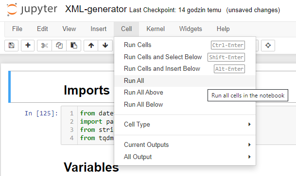

# DOI XML file generator from Excel
## Instalation
- Download and install python from https://www.python.org
- In cmd open repo directory and use:
> pip install -r requirements.txt

## Usage

### Excel file structure

Rows from 1 to 7 are reserved for additional informations.

Rows 8 is for headers, in this format:

|N|Title|Copyright Assignment YES/NO|Abstract|Corresponding FName|Corresponding LName|DOI|URL - GITBOOK|URL - GITHUB|Status|Author1 First Name|Author1 Last Name|...|AuthorN First Name|AuthorN Last|
|---|---|---|---|---|---|---|---|---|---|---|---|---|---|---|
|1|Title|YES/NO|Abstract|FName|LName|DOI|URL - GITBOOK|URL - GITHUB|Status|Author1 First Name|Author1 Last Name|...|AuthorN First Name|AuthorN Last|
|Last|Title|YES/NO|Abstract|FName|LName|DOI|URL - GITBOOK|URL - GITHUB|Status|Author1 First Name|Author1 Last Name|...|AuthorN First Name|AuthorN Last|
||||||||||End||||||

Where N is number specifying the maximum number of authors.

After the last row of full-papers the Status must be set to End.

Statuses other than Ok will not be included in the XML generator.

### Jupter
- In cmd open repo directory and use:
> jupyter notebook

In order to generate an XML file, set the values ​​in the Variables tab, and then select Cell > Run all from the menu. 

After the file is generated, the dois.xml file will appear in the folder. There can only be one dois.xml file in the folder - delete it to recreate it.

